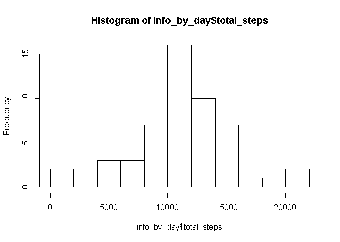
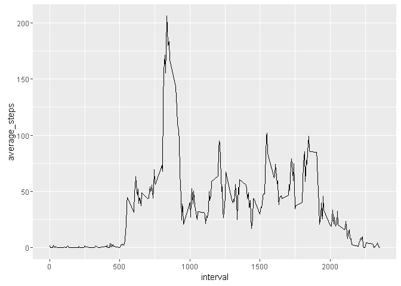
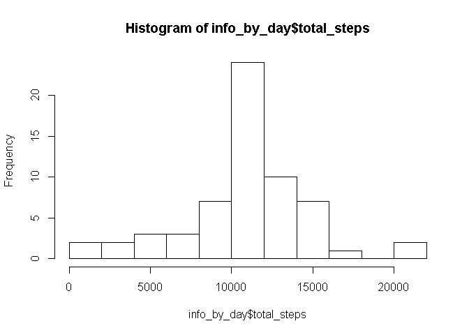
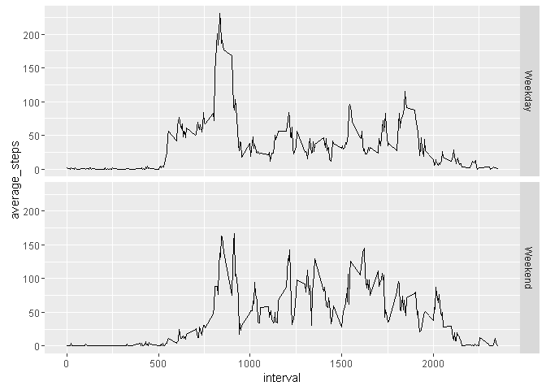

# Reproducible Research: Peer Assessment 1
Firstly we should load dplyr and ggplot2 packages, it'll help us to manage 
datasets in more convenient way and build nice and informative plots.

```r
library(dplyr)
```

```
## 
## Attaching package: 'dplyr'
```

```
## The following objects are masked from 'package:stats':
## 
##     filter, lag
```

```
## The following objects are masked from 'package:base':
## 
##     intersect, setdiff, setequal, union
```

```r
library(ggplot2)
```

## Loading and preprocessing the data
Let's read our table.

```r
info <- tbl_df(read.csv("activity.csv"))
```

## What is mean total number of steps taken per day?

Ok. To retrieve useful information, we should group our dataframe
by date and create new dataset with total amount of steps each day.

```r
info_grouped_by_day <- group_by(info, date)
info_by_day <- summarise(info_grouped_by_day, total_steps = sum(steps))
```

Fine. Let's see what we have.


```r
hist(info_by_day$total_steps, breaks = 10)
```

<!-- -->

Let's go on. We need to calculate mean and median for amount of steps taken
each day.

```r
mean_steps <- aggregate(steps ~ date, data = info, FUN = mean, na.rm = TRUE)
median_steps <- aggregate(steps ~ date, data = info, FUN = median, na.rm = TRUE)
```
Let's see what we have. To do this I prefere to generate few random numbers, 
and print spectacular columns.

```r
set.seed(8800555)
columns <- sample(1:nrow(median_steps), 5, replace = FALSE)

print(median_steps[columns, ])
```

```
##          date steps
## 38 2012-11-13     0
## 11 2012-10-13     0
## 30 2012-11-02     0
## 41 2012-11-17     0
## 20 2012-10-22     0
```

```r
print(mean_steps[columns, ])
```

```
##          date    steps
## 38 2012-11-13 25.47222
## 11 2012-10-13 43.14583
## 30 2012-11-02 36.80556
## 41 2012-11-17 49.78819
## 20 2012-10-22 46.73611
```
It's remarkable that despite mean of steps is usually big enough, median of
them is zero. Let's find out, whether all the medians equal zero.


```r
sum(median_steps$steps == 0) == nrow(median_steps)
```

```
## [1] TRUE
```
That's it, all the medians equal zero. It's not so bizzare, because there is 
a lot of zeros in "steps" column of the dataframe. 

## What is the average daily activity pattern?

Now it'll be good to group main dataframe by time, and create new dataframe
with useful information.

```r
info_grouped_by_time <- group_by(info, interval)
info_by_time <- summarise(info_grouped_by_time, 
      average_steps = mean(steps, na.rm = TRUE))
```
We've accomplished that! Let's now create a plot with ggplot2 package, so our
plot will be aesthetical and informative.

Let's plot a dependence between interval and average amount of steps taken in
it. That's the average daily activity pattern.

```r
time_plot <- ggplot(info_by_time, aes(interval, average_steps))
time_plot + geom_line()
```

<!-- -->

We see that there is a huge ledge at some point.
Let's find out the interval when the average amount of steps is maximal.


```r
info_by_time[which.max(info_by_time$average_steps), ]
```

```
## Source: local data frame [1 x 2]
## 
##   interval average_steps
##      (int)         (dbl)
## 1      835      206.1698
```
We've found it. Great work!

## Imputing missing values

Now let's deal with NAs in our dataset.

Firstly, I consider we should calculate total number of missing values in 
our dataframe.

```r
sum(is.na(info))
```

```
## [1] 2304
```
Quite a lot, isn't it?

Let's imput values instead of NAs now to make our dataset full.

Firstly, we should determine in which columns there are NAs.

```r
NAs <- which(is.na(info$steps))
```
I've chosen one simple strategy to imput missing data.

We're going to find average amount of steps taken in interval, that is included
in column, where an amount of steps is missed. We're also going to add some
randomisation and for that purpose we're going to generate a rnorm positive
number with mean = 1 and standart deviation = 0.3.

```r
for (i in NAs) {
      NA_interval <- info[i, "interval"]
      NA_interval <- NA_interval[[1]]
      
      average_steps_for_this_interval <- 
            filter(info_by_time, interval == NA_interval)$average_steps
      
      info[i, "steps"] = average_steps_for_this_interval 
            + rnorm(1, mean = 1, sd = 0.3)
}

head(info)
```

```
## Source: local data frame [6 x 3]
## 
##       steps       date interval
##       (dbl)     (fctr)    (int)
## 1 1.7169811 2012-10-01        0
## 2 0.3396226 2012-10-01        5
## 3 0.1320755 2012-10-01       10
## 4 0.1509434 2012-10-01       15
## 5 0.0754717 2012-10-01       20
## 6 2.0943396 2012-10-01       25
```

Now let's see what've changed. Let's repeat what we've done in the beginning
(create histogram with total amount of steps each day).

```r
info_grouped_by_day <- group_by(info, date)
info_by_day <- summarise(info_grouped_by_day, total_steps = sum(steps),
      average_steps = mean(steps, na.rm = TRUE, median_steps = median(steps)))

hist(info_by_day$total_steps, breaks = 10)
```

<!-- -->

We can notice that the number of days when between 10000 and 12500 steps
has increased greatly. Others've increased too, but on a little.

Let's now find out whether means and medians have changed too.


```r
mean_steps <- aggregate(steps ~ date, data = info, FUN = mean, na.rm = TRUE)
median_steps <- aggregate(steps ~ date, data = info, FUN = median, na.rm = TRUE)

print(mean_steps)
```

```
##          date      steps
## 1  2012-10-01 37.3825996
## 2  2012-10-02  0.4375000
## 3  2012-10-03 39.4166667
## 4  2012-10-04 42.0694444
## 5  2012-10-05 46.1597222
## 6  2012-10-06 53.5416667
## 7  2012-10-07 38.2465278
## 8  2012-10-08 37.3825996
## 9  2012-10-09 44.4826389
## 10 2012-10-10 34.3750000
## 11 2012-10-11 35.7777778
## 12 2012-10-12 60.3541667
## 13 2012-10-13 43.1458333
## 14 2012-10-14 52.4236111
## 15 2012-10-15 35.2048611
## 16 2012-10-16 52.3750000
## 17 2012-10-17 46.7083333
## 18 2012-10-18 34.9166667
## 19 2012-10-19 41.0729167
## 20 2012-10-20 36.0937500
## 21 2012-10-21 30.6284722
## 22 2012-10-22 46.7361111
## 23 2012-10-23 30.9652778
## 24 2012-10-24 29.0104167
## 25 2012-10-25  8.6527778
## 26 2012-10-26 23.5347222
## 27 2012-10-27 35.1354167
## 28 2012-10-28 39.7847222
## 29 2012-10-29 17.4236111
## 30 2012-10-30 34.0937500
## 31 2012-10-31 53.5208333
## 32 2012-11-01 37.3825996
## 33 2012-11-02 36.8055556
## 34 2012-11-03 36.7048611
## 35 2012-11-04 37.3825996
## 36 2012-11-05 36.2465278
## 37 2012-11-06 28.9375000
## 38 2012-11-07 44.7326389
## 39 2012-11-08 11.1770833
## 40 2012-11-09 37.3825996
## 41 2012-11-10 37.3825996
## 42 2012-11-11 43.7777778
## 43 2012-11-12 37.3784722
## 44 2012-11-13 25.4722222
## 45 2012-11-14 37.3825996
## 46 2012-11-15  0.1423611
## 47 2012-11-16 18.8923611
## 48 2012-11-17 49.7881944
## 49 2012-11-18 52.4652778
## 50 2012-11-19 30.6979167
## 51 2012-11-20 15.5277778
## 52 2012-11-21 44.3993056
## 53 2012-11-22 70.9270833
## 54 2012-11-23 73.5902778
## 55 2012-11-24 50.2708333
## 56 2012-11-25 41.0902778
## 57 2012-11-26 38.7569444
## 58 2012-11-27 47.3819444
## 59 2012-11-28 35.3576389
## 60 2012-11-29 24.4687500
## 61 2012-11-30 37.3825996
```

```r
print(median_steps)
```

```
##          date    steps
## 1  2012-10-01 34.11321
## 2  2012-10-02  0.00000
## 3  2012-10-03  0.00000
## 4  2012-10-04  0.00000
## 5  2012-10-05  0.00000
## 6  2012-10-06  0.00000
## 7  2012-10-07  0.00000
## 8  2012-10-08 34.11321
## 9  2012-10-09  0.00000
## 10 2012-10-10  0.00000
## 11 2012-10-11  0.00000
## 12 2012-10-12  0.00000
## 13 2012-10-13  0.00000
## 14 2012-10-14  0.00000
## 15 2012-10-15  0.00000
## 16 2012-10-16  0.00000
## 17 2012-10-17  0.00000
## 18 2012-10-18  0.00000
## 19 2012-10-19  0.00000
## 20 2012-10-20  0.00000
## 21 2012-10-21  0.00000
## 22 2012-10-22  0.00000
## 23 2012-10-23  0.00000
## 24 2012-10-24  0.00000
## 25 2012-10-25  0.00000
## 26 2012-10-26  0.00000
## 27 2012-10-27  0.00000
## 28 2012-10-28  0.00000
## 29 2012-10-29  0.00000
## 30 2012-10-30  0.00000
## 31 2012-10-31  0.00000
## 32 2012-11-01 34.11321
## 33 2012-11-02  0.00000
## 34 2012-11-03  0.00000
## 35 2012-11-04 34.11321
## 36 2012-11-05  0.00000
## 37 2012-11-06  0.00000
## 38 2012-11-07  0.00000
## 39 2012-11-08  0.00000
## 40 2012-11-09 34.11321
## 41 2012-11-10 34.11321
## 42 2012-11-11  0.00000
## 43 2012-11-12  0.00000
## 44 2012-11-13  0.00000
## 45 2012-11-14 34.11321
## 46 2012-11-15  0.00000
## 47 2012-11-16  0.00000
## 48 2012-11-17  0.00000
## 49 2012-11-18  0.00000
## 50 2012-11-19  0.00000
## 51 2012-11-20  0.00000
## 52 2012-11-21  0.00000
## 53 2012-11-22  0.00000
## 54 2012-11-23  0.00000
## 55 2012-11-24  0.00000
## 56 2012-11-25  0.00000
## 57 2012-11-26  0.00000
## 58 2012-11-27  0.00000
## 59 2012-11-28  0.00000
## 60 2012-11-29  0.00000
## 61 2012-11-30 34.11321
```

You can notice that there are not only zeroes in median_steps now!

## Are there differences in activity patterns between weekdays and weekends?

I think that we should search for interesting information in dates of
observations. To make work with dates simpler we're loading lubridate package.


```r
library(lubridate)
```

Let's add to our original dataset new column which describes at which type of 
weekday is this observation was recorded.

```r
info <- mutate(info, weekday = wday(as.POSIXlt(date)),
      type_of_day = factor(ifelse(weekday == 1 | weekday == 7, "Weekend", 
            "Weekday")))
```

Now let's group the main dataset by weekday type and time, and calculate average 
number of steps.

```r
info_grouped_by_day_and_time <- group_by(info, interval, type_of_day)
info_by_day_and_time <- summarise(info_grouped_by_day_and_time, 
      average_steps = mean(steps))

head(info_by_day_and_time)
```

```
## Source: local data frame [6 x 3]
## Groups: interval [3]
## 
##   interval type_of_day average_steps
##      (int)      (fctr)         (dbl)
## 1        0     Weekday    2.25115304
## 2        0     Weekend    0.21462264
## 3        5     Weekday    0.44528302
## 4        5     Weekend    0.04245283
## 5       10     Weekday    0.17316562
## 6       10     Weekend    0.01650943
```

Now let's plot a dependence between interval and average number of steps for
weekdays and weekends.

```r
weektime_plot <- ggplot(info_by_day_and_time, aes(interval, average_steps))
weektime_plot + geom_line() + facet_grid(type_of_day ~ .)
```

<!-- -->

The only thing that we can notice is that on weekend there are less steps that
on weekdays, and they're distributed more evenly on weekends.
